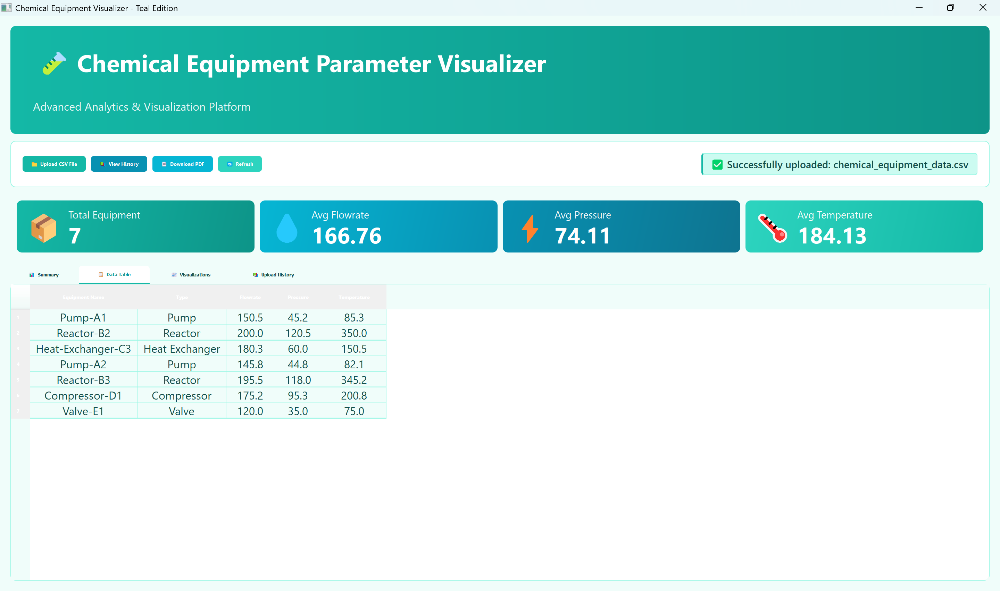
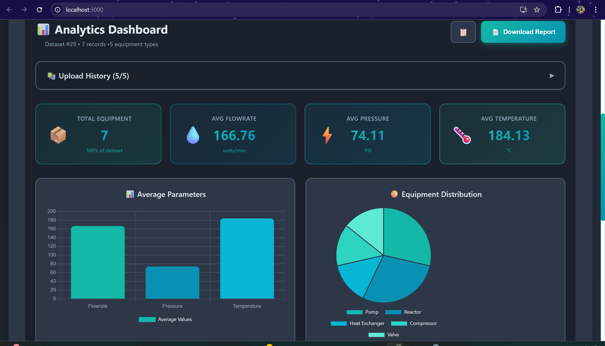
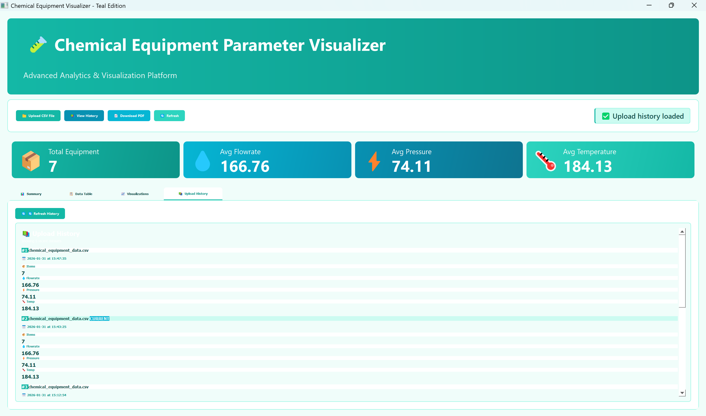

# 🧪 Chemical Equipment Parameter Visualizer

> A modern hybrid application for analyzing and visualizing chemical equipment data with both web and desktop interfaces.

[](https://python.org)
[](https://djangoproject.com)
[](https://reactjs.org)
[](https://www.riverbankcomputing.com/software/pyqt/)

---

## 📋 Table of Contents

- [Features](#features)
- [Screenshots](#screenshots)
- [Tech Stack](#tech-stack)
- [Installation](#installation)
- [Usage](#usage)
- [Project Structure](#project-structure)
- [API Documentation](#api-documentation)

---

## ✨ Features

### Core Features
- 📤 **CSV File Upload** - Upload equipment data with drag & drop support
- 📊 **Interactive Visualizations** - Beautiful charts using Chart.js and Matplotlib
- 📈 **Real-time Analytics** - Automatic calculation of statistics and distributions
- 💾 **History Management** - Stores last 5 uploaded datasets with complete summaries
- 📄 **PDF Reports** - Generate downloadable PDF reports with authentication
- 🔐 **Secure Authentication** - Basic authentication for sensitive operations

### Advanced Features
- 🌙 **Dark Mode** - Toggle between light and dark themes (Web App)
- 🎨 **Custom Themes** - Beautiful Teal & White theme (Desktop App)
- 📱 **Fully Responsive** - Works seamlessly on all devices
- 🎭 **Smooth Animations** - Modern UI with transitions and effects
- 🔄 **Drag & Drop Upload** - Modern file upload experience
- 📚 **Rich History View** - Detailed upload history with statistics

---

## 📸 Screenshots

### Web Application - Light Mode


### Web Application - Dark Mode


### Desktop Application


### Data Visualizations


### PDF AUTHENTICATION


### Upload History in Desktop Application


---

## 🛠️ Tech Stack

### Backend
- **Framework**: Django 4.2 + Django REST Framework
- **Database**: SQLite
- **Data Processing**: Pandas
- **PDF Generation**: ReportLab
- **Authentication**: Django Basic Auth

### Web Frontend
- **Framework**: React 18
- **Charts**: Chart.js + react-chartjs-2
- **HTTP Client**: Axios
- **Styling**: Modern CSS with gradients & animations

### Desktop Frontend
- **Framework**: PyQt5
- **Charts**: Matplotlib
- **HTTP Client**: Requests
- **Theme**: Custom Teal & White design

---

## 🚀 Installation

### Prerequisites

- Python 3.8 or higher
- Node.js 16 or higher
- Git

### Backend Setup
```bash
# Clone the repository
git clone https://github.com/sanjanamandal1/chemical-equipment-visualizer.git
cd chemical-equipment-visualizer

# Navigate to backend
cd backend

# Create virtual environment
python -m venv venv

# Activate virtual environment
# Windows:
venv\Scripts\activate
# Mac/Linux:
source venv/bin/activate

# Install dependencies
pip install -r requirements.txt

# Run migrations
python manage.py makemigrations
python manage.py migrate

# Create superuser (for PDF authentication)
python manage.py createsuperuser

# Start development server
python manage.py runserver
```

Backend will be available at `http://localhost:8000`

### Web Frontend Setup
```bash
# Navigate to web frontend
cd ../frontend-web

# Install dependencies
npm install

# Start development server
npm start
```

Web app will be available at `http://localhost:3000`

### Desktop App Setup
```bash
# Activate backend virtual environment
cd ../backend
venv\Scripts\activate  # Windows
# source venv/bin/activate  # Mac/Linux

# Navigate to desktop frontend
cd ../frontend-desktop

# Install dependencies (if not already installed)
pip install -r requirements.txt

# Run desktop application
python main.py
```

---

## 💡 Usage

### Web Application

1. Navigate to `http://localhost:3000`
2. **Upload CSV**: 
   - Drag & drop your CSV file or click to browse
   - File must include columns: Equipment Name, Type, Flowrate, Pressure, Temperature
3. **View Dashboard**:
   - See summary statistics in colorful cards
   - Explore interactive bar and pie charts
   - Browse complete data table
4. **Toggle Dark Mode**: Click the moon/sun icon in the navigation bar
5. **View History**: Expand the history panel to see last 5 uploads
6. **Download Report**: Click "Download PDF Report" and enter your credentials

### Desktop Application

1. Launch: `python main.py`
2. **Upload CSV**: Click "📁 Upload CSV File" button
3. **Navigate Tabs**:
   - **Summary**: View key statistics and metrics
   - **Data Table**: Browse complete dataset
   - **Visualizations**: Explore charts and graphs
4. **View History**: Click "📚 View History" to see past uploads
5. **Download Report**: Click "📄 Download PDF" (requires authentication)
6. **Refresh**: Click "🔄 Refresh" to update the display

### CSV Format

Your CSV file should follow this structure:
```csv
Equipment Name,Type,Flowrate,Pressure,Temperature
Pump-A1,Pump,150.5,45.2,85.3
Reactor-B2,Reactor,200.0,120.5,350.0
Heat-Exchanger-C3,Heat Exchanger,180.3,60.0,150.5
```

Sample file included: `backend/sample_equipment_data.csv`

---

## 📁 Project Structure
```
chemical-equipment-visualizer/
├── backend/                      # Django Backend
│   ├── api/                     # API Application
│   │   ├── models.py           # Database models
│   │   ├── views.py            # API endpoints & business logic
│   │   ├── serializers.py      # Data serializers
│   │   └── urls.py             # API routing
│   ├── config/                  # Django configuration
│   │   ├── settings.py         # Project settings
│   │   └── urls.py             # Main URL routing
│   ├── media/                   # Uploaded files storage
│   ├── db.sqlite3              # SQLite database
│   ├── manage.py               # Django management script
│   ├── requirements.txt        # Python dependencies
│   └── sample_equipment_data.csv
│
├── frontend-web/                # React Web App
│   ├── public/                 # Static files
│   ├── src/
│   │   ├── components/
│   │   │   ├── UploadCSV.js   # File upload component
│   │   │   └── Dashboard.js    # Visualization dashboard
│   │   ├── App.js              # Main React component
│   │   ├── App.css             # Styles & animations
│   │   └── index.js            # Entry point
│   ├── package.json            # Node dependencies
│   └── README.md
│
├── frontend-desktop/            # PyQt5 Desktop App
│   ├── main.py                 # Main application file
│   └── requirements.txt        # Python dependencies
│
├── screenshots/                 # Project screenshots
├── .gitignore                   # Git ignore rules
└── README.md                    # This file
```

---

## 📚 API Documentation

### Base URL
```
http://localhost:8000/api/
```

### Endpoints

#### 1. Upload Dataset
```http
POST /api/datasets/upload/
Content-Type: multipart/form-data

Request Body:
{
  "file": <CSV_FILE>
}

Response: 201 Created
{
  "id": 1,
  "name": "sample_equipment_data.csv",
  "uploaded_at": "2026-01-31T10:30:00Z",
  "summary": {
    "total_count": 7,
    "avg_flowrate": 166.76,
    "avg_pressure": 74.40,
    "avg_temperature": 184.14,
    "equipment_types": {
      "Pump": 2,
      "Reactor": 2,
      "Heat Exchanger": 1,
      "Compressor": 1,
      "Valve": 1
    }
  },
  "data": [...]
}
```

#### 2. List All Datasets
```http
GET /api/datasets/

Response: 200 OK
[
  {
    "id": 1,
    "name": "equipment_data.csv",
    "uploaded_at": "2026-01-31T10:30:00Z",
    "total_count": 7,
    "avg_flowrate": 166.76,
    ...
  }
]
```

#### 3. Get Single Dataset
```http
GET /api/datasets/{id}/

Response: 200 OK
{
  "id": 1,
  "name": "equipment_data.csv",
  ...
}
```

#### 4. Generate PDF Report (Requires Authentication)
```http
GET /api/datasets/{id}/generate_report/
Authorization: Basic <base64_encoded_credentials>

Response: 200 OK
Content-Type: application/pdf
```

---

## 🐛 Troubleshooting

### React App Won't Start (Windows)
```powershell
# Set environment variables
$env:TEMP = "$env:USERPROFILE\AppData\Local\Temp"
$env:TMP = "$env:USERPROFILE\AppData\Local\Temp"
npm start
```

### CORS Errors

Ensure `CORS_ALLOW_ALL_ORIGINS = True` in `backend/config/settings.py`

### Desktop App Connection Issues

1. Verify Django backend is running at `http://localhost:8000`
2. Check firewall settings
3. Ensure virtual environment is activated

### Database Errors
```bash
# Reset database
cd backend
rm db.sqlite3
python manage.py migrate
python manage.py createsuperuser
```

---

## 👨‍💻 Development

### Running Tests
```bash
# Backend tests
cd backend
python manage.py test

# Frontend tests
cd frontend-web
npm test
```

### Code Style

- **Python**: PEP 8
- **JavaScript**: ESLint
- **Commits**: Conventional Commits format

---

## 🤝 Contributing

Contributions are welcome! Please feel free to submit a Pull Request.

1. Fork the repository
2. Create your feature branch (`git checkout -b feature/AmazingFeature`)
3. Commit your changes (`git commit -m 'Add some AmazingFeature'`)
4. Push to the branch (`git push origin feature/AmazingFeature`)
5. Open a Pull Request

---

## 📝 License

This project is licensed under the MIT License - see the [LICENSE](LICENSE) file for details.

---

## 👏 Acknowledgments

- Django & Django REST Framework teams
- React & Chart.js communities
- PyQt5 & Matplotlib developers
- All contributors and supporters

---

## 📧 Contact

**Sanjana Mandal** - [@sanjanamandal1](https://github.com/sanjanamandal1)

**Project Link**: [https://github.com/sanjanamandal1/chemical-equipment-visualizer](https://github.com/sanjanamandal1/chemical-equipment-visualizer)

---

## 🌟 Show Your Support

If you found this project helpful, please give it a ⭐️!

---

**Made with ❤️ for Chemical Equipment Analysis**

[def]: screenshots/desktop-app.png